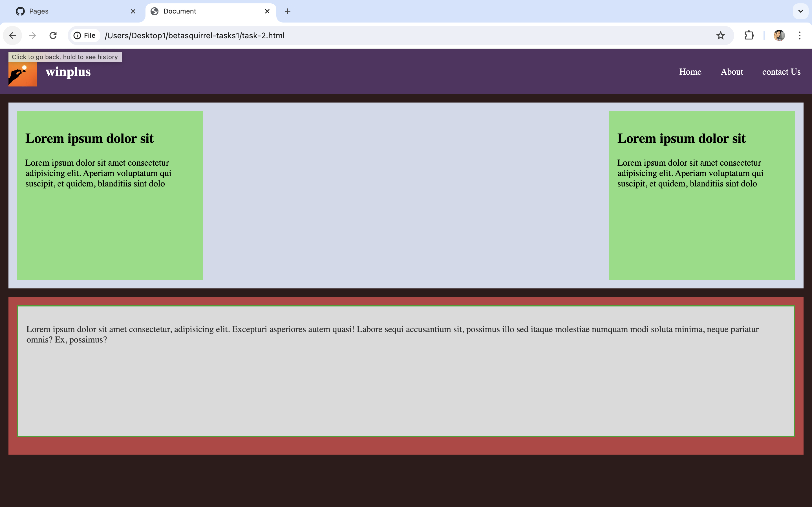
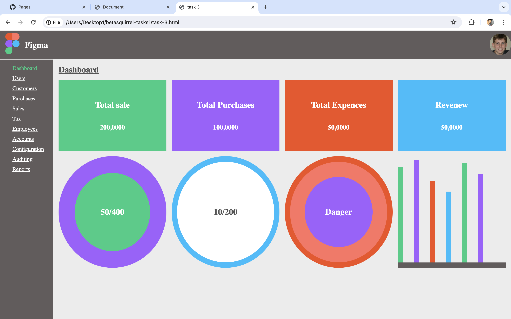

# betasquirrel-tasks

Assignment form betasquirrel

## Requirements

| Requirements                    |Out put |
|---------------------------------|--------|
|   |  Two   ||
|     |  Two   |

### Formatting
 
 Lorem ipsum ***dolor sit amet consectetur adipisicing elit.*** Aperiam  _voluptatum qui suscipit,_  ~~ et quidem, blanditiis~~ sint dolo

 `git commit`

 ## linex commands

 - `cd` - change current directory. Ex: `cd desktop`, `cd..`
 -`ls` - list contents of a directory. Ex `ls-a` list hidden files as well.
 -`pwd` - display current working directory path
 -`cat` - display contents of a file. Ex `cat README.md`

 ## git commants

 1. `git config` configure git user. Ex: `git config --global user name "salmanfrz889"`, `git config user. email "salmanfrz889@gmail.com"`
 2. `git clone` Clone a remote git rephtpo to your local. Ex: `git clone https://github.com/salmanfrs889/betasquirrel-tasks.git`, `git clone  https://github.com/salmanfrs889/betasquirrel-tasks.git new-folder`
 3. `git add` Add your file changes to git. Ex: `git add .`, `git add README.md`
 4. `git commit` commit changes to git. Ex: `git commit -m "Initial commit"`
 5. `git push` push your local commit to remote repo. Ex: `git push origin main` 

 ## Task 3

 Real the below pages and attend the tests.

 - [HTML](https://www.w3schools.com/html/default.asp)
 - [Attributes](https://www.w3school.com/html/html_attributes.asp) 

 # Responsive Design Simension

 - xs ( <576 )
 - sm ( >=576 )
 - md ( >=768 )
 - lg ( >=992 )
 - xl ( >=1200 )
 - xxl ( >=1400 )

 - mobile `@media only screen and (mx-width: 767px) {}`
 - tablet `@media only screen and (max-width: 991px) and (min-width: 768) {}`

 # Demo

 - Task -1&2  =  https://salmanfrz889.github.io/betasquirrel-tasks/task-2.html
 - Task- 3    =  https://salmanfrz889.github.io/betasquirrel-tasks/task-3.html
 - Task- 5    =  https://salmanfrz889.github.io/betasquirrel-tasks/task-5/task-5.html
 - admission  =  https://salmanfrz889.github.io/betasquirrel-tasks/task-5/admission.html
 - admission-1=  https://salmanfrz889.github.io/betasquirrel-tasks/task-5/admission-1.html